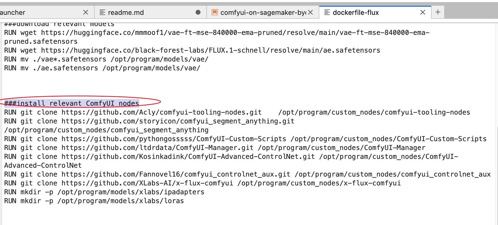
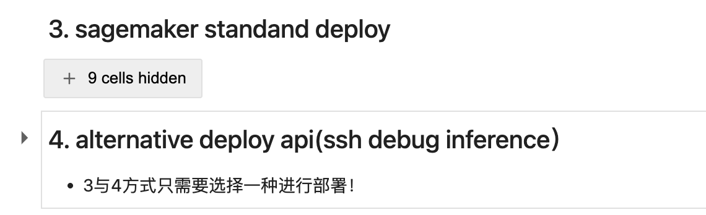
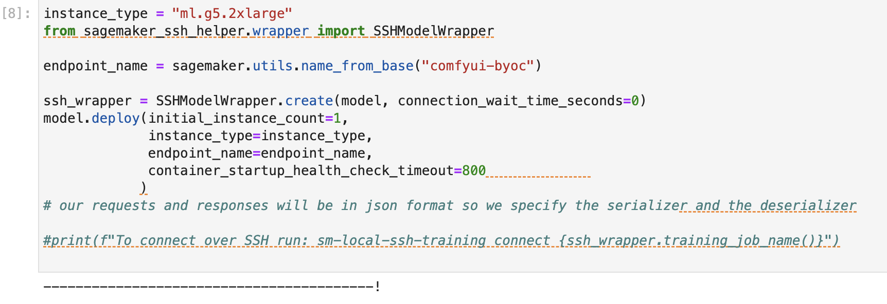
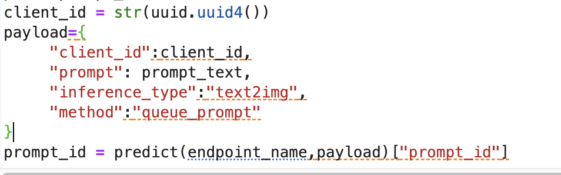
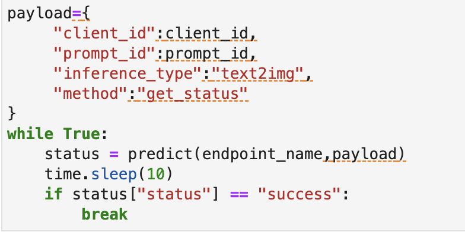
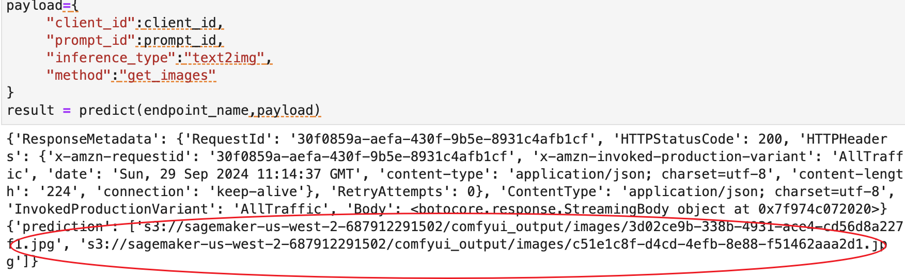

# Comfyui on SageMaker API 部署说明

## 开发测试环境安装

参考comfyui workshop https://catalog.us-east-1.prod.workshops.aws/workshops/c8b69f68-660a-432b-9295-2544b455684a 中2.1 ComfyUI installtion章节，在EC2实例上安装部署即可
* Comyfui API具有很好的一致性，在EC2 开发测试环境上调试好的workflow，可以导出api json，从而在SageMaker的推理端点上一致性的调用
* Comyfui EC2上所安装的customer nodes和所需要的模型，在SageMaker的endpoint上部署方法见下章节详细说明

 

## SageMaker ComfyUI endpoint部署
* 新开一个SageMaker notebook instance实例，选择g5.xlarge机型，注意EBS磁盘卷需要100Gb以上，以免空间不足
* 进入notebook jupyterlab，新建子目录，git clone https://github.com/qingyuan18/ComfyUI-on-SageMaker.git 
* 配置dockerfile
  - 在克隆的Comfyui-on-Sagemaker代码目录中，找到docker子目录
  - 不同的dockerfile针对不同comfyui版本，最新的为dockerfile-flux
  - 编辑dockerfile-flux，在###install relevant ComfyUI nodes章节，增加需要的customer nodes的git repo地址
  
  - 也可以在dockerfile中pip install增加需要用到的其他lib（e.g opencv)
  
* 配置模型文件
  - 模型checkpoint文件会在部署的时候，根据传入的环境变量值自行同步到sagemaker endpoint推理机器对应comyfui目录下
  - 上传所需要的flux/sd模型到s3路径，注意不同的模型最好用不同的目录区分（e.g： controlnet/lora/ipadapter...etc)
  - 在部署notebook的环境变量中，根据不同模型类型，传入不同的环境变量，其中key为模型类型，value为s3路径
  
  - 如果有其他第三方模型（e.g sam/groudingdino），可以传入“；”分隔的多个模型类型，其中模型类型和s3路径用"|"隔开（e.g：sams|s3://sagemaker-us-west-2-687912291502/models/sam;grounding-dino|s3://sagemaker-us-west-2-687912291502/models/groundingdino）

* 执行部署
  - 在克隆的Comfyui-on-Sagemaker代码目录中，找到comfyui-on-sagemaker-byoc.ipynb notebook
  - 逐步执行build及deploy部署脚本的所有cell单元格
  - 注意：3. sagemaker standand deploy 和4. alternative deploy api(ssh debug inference）两种方式只需要选一种方式
  - 如果用4. alternative deploy api(ssh debug inference）方式部署，需要配置sagemaker ssh helper所需要的SSM权限，并打开EC2高阶 Tier
  
  - 等待部署完成
  

 

## 测试API调用
* Comfyui on SageMaker封装predict报文，其中包含以下主要调用方法，分别如下
  - queue_prompt method，对应compfyui的提交任务api，调用后，sagemaker返回prompt id任务编号
  
  - get_status method,查询任务执行状态，当为success时表示comfyui 后台执行完成
  
  - get_images method，获取任务id对应的结果图像并上传到s3路径，如果工作流中有多个结果保存节点，则会把每一个节点图像都取出，返回s3路径数组
  - 如果是视频生成工作流，get_images方法会返回生成的gifs/webp格式视频文件，同样上传至s3路径并返回结果
  

